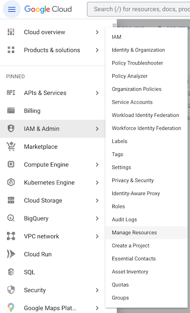
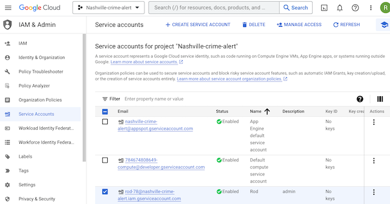
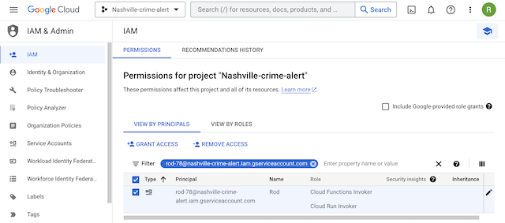
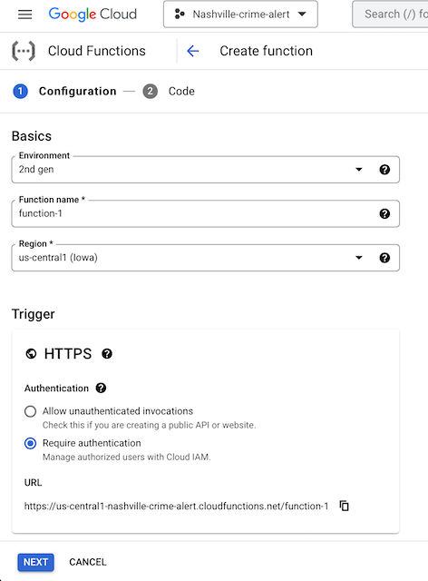
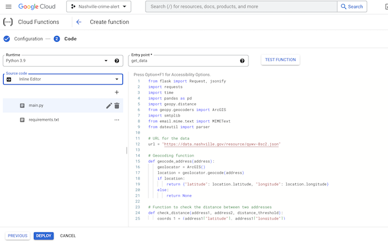
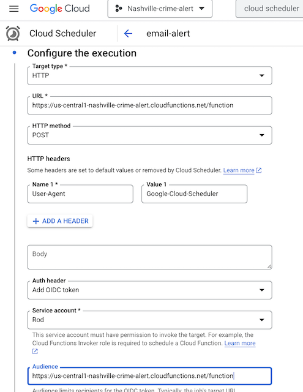
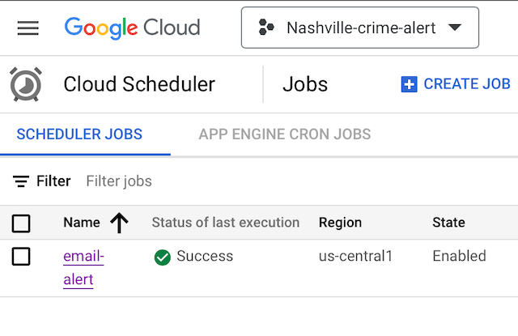

# Get notified when a crime or incident takes place near your location
This is a python script that sends alerts based on activity from Metro Nashville's Active Dispatch.
https://www.nashville.gov/departments/police/online-resources/active-dispatches

Steps to implement:

1. Setup "2-Step Verification" on your Google account using these steps [here.](https://gist.github.com/darwin/ee9e7855882b6f6b450fe45e9a5aa0b0?permalink_comment_id=4567140#gistcomment-4567140)
2. Insert your email address and password from step 1 above into the "send email" function.
3. Insert a physical address and set the distance threshold (current distance is set to 1 mile).
4. Place recipient email address at the end of the script.

To automate and run locally you can save the script as a .py file and run it as a CRON job on your computer using 
these steps [here.](https://www.jcchouinard.com/python-automation-with-cron-on-mac/)

Or you can follow these steps to automate it as a Google Cloud Function for free!

### 1. In the Google Cloud console, under IAM & Admin, click on “Manage Resources” then click “+ CREATE PROJECT” (in blue text).

### 2. Create a new service account (in addition to the default service accounts) under your project.

### 3. Click on IAM and “GRANT ACCESS” to your service account. The roles required are “Cloud Functions Invoker” and “Cloud Run Invoker.”

### 4. In the search bar, type “cloud functions” and click “CREATE FUNCTION.” You will use the URL as the trigger for scheduling. Click "NEXT"

### 5. This is where you will insert/upload the code and requirements.txt file. Use get_data as the entry point then click deploy and wait for it to build successfully.

### 6. Search for “cloud scheduler” and click on “CREATE JOB.” According to Nashville’s active dispatch, the data is updated approximately every 15 minutes so the CRON syntax for this is: 

> */15 * * * *

### Under “Configure the execution” set the Target type to HTTP, the URL to the url for the cloud function and the HTTP method as POST. Set the Auth header to “Add OIDC token,” select the service account with the proper permissions you created earlier and set the Audience as the cloud function URL. Click “CREATE” and you’re done!

### On the Cloud Scheduler page you should see a green check mark if the function runs successfully. 

If there are any errors, check the logs to see exactly what went wrong. In order to make sure the alerts went through, 
I increased the distance threshold to 10 miles and force ran the job. After confirming the alerts work, I then went 
back into the source code of the cloud function and set the distance threshold back to 1 mile.

If this is too much work, you can check out a real time map visualization on my [app.](https://github.com/RodNSS/Nashville_Active_Incident_Map)

The script currently uses email for alerts as I found Verizon's email to text service "@vtext.com" to be unreliable. 
I know there are paid SMS services but the goal was to automate this for free. Stay safe and happy automating!
